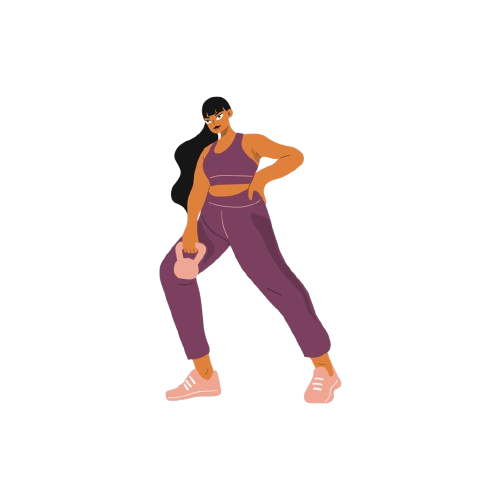

<div id="top"></div>
<div align="center">

  
  
  
</div>

<br />
<div align="center">
  <a href="">
    
  </a>

<h3 align="center">Birthday Reminder API</h3>

  <p align="center">
    <a href="">Report Bug</a>
    ·
    <a href="">Request Feature</a>
  </p>
</div>

<details>
  <summary>Table of Contents</summary>
  <ol>
    <li>
      <a href="#">About The Project</a>
    </li>
    <li>
      <a href="#">Getting Started</a>
      <ul>
        <li><a href="#">Prerequisites</a></li>
        <li><a href="#">Installation</a></li>
      </ul>
    <li><a href="#">System Design & Architecture</a></li>
    </li>
      <ul>
        <li><a href="#">Database Design</a></li>
      </ul>
    <li><a href="#">Usage</a></li>
    <ul>
        <li><a href="#">Authentication</a></li>
    </ul>

  </ol>
</details>

## About The Project
### 🚀 Getting Started

1. Clone repository and setup virtual environment. Install all project requirements.
```sh
  $ pip install -r requirements/base.txt
```

2. Setup Postgres on your local machine and run migrations.
```sh
  $ python manage.py migrate
```

3. Run development server.
```sh
  $ python manage.py runserver
```

## 🚀 System Design & Architecture

###  Database Design Diagram
<div align="center">

  <a href="">
    
  </a>
</div >

## 💯 Usage

### 🔑 Authentication 

birthday-reminder api uses `JWT` as the primary form of authentication. 
The endpoints provided for obtaining a token and refreshing a token are:
```sh
$ 127.0.0.1:8000/api/token

$ 127.0.0.1:8000/api/token/refresh
```
<p align="right">(<a href="#top">back to top</a>)</p>